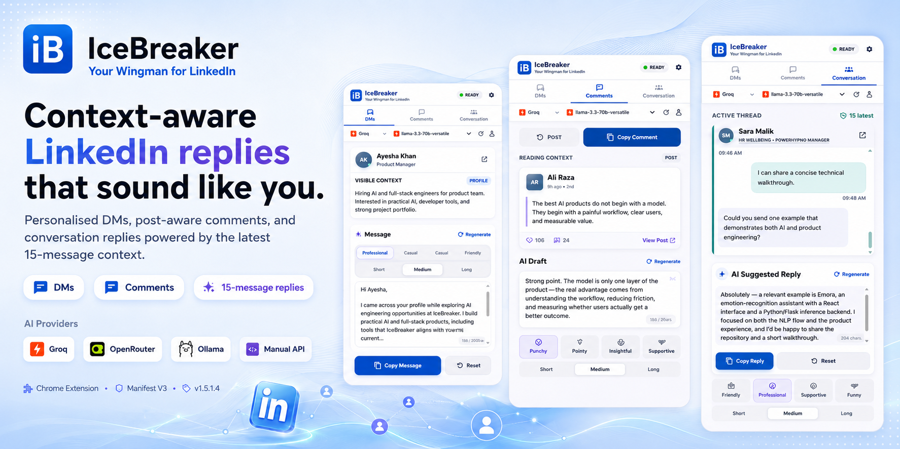
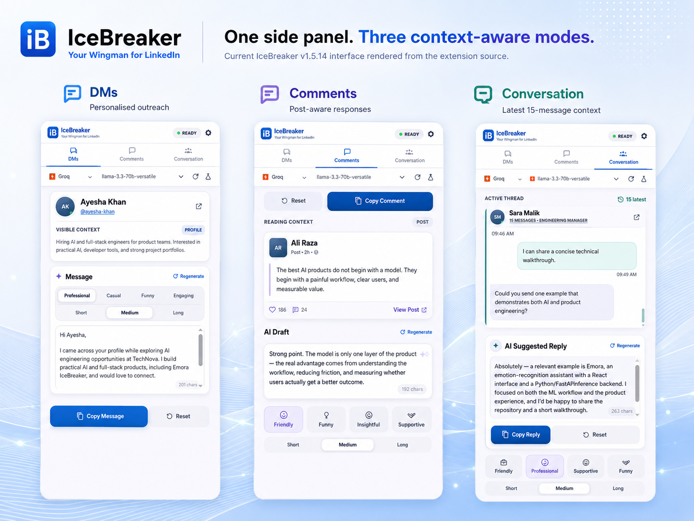
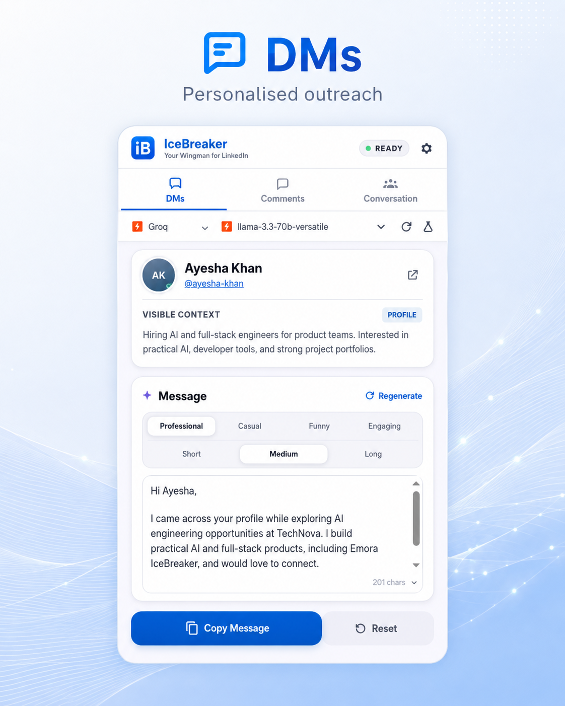
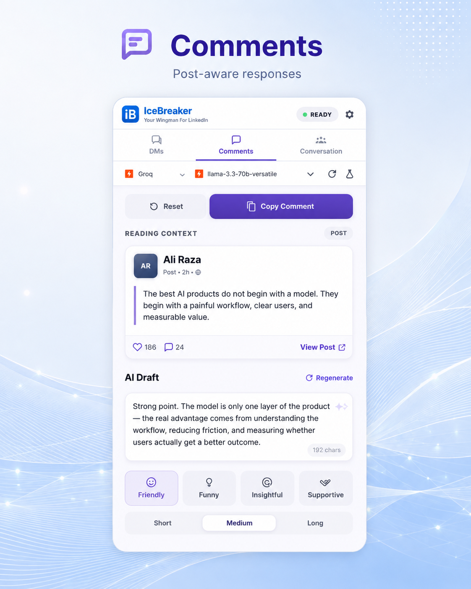
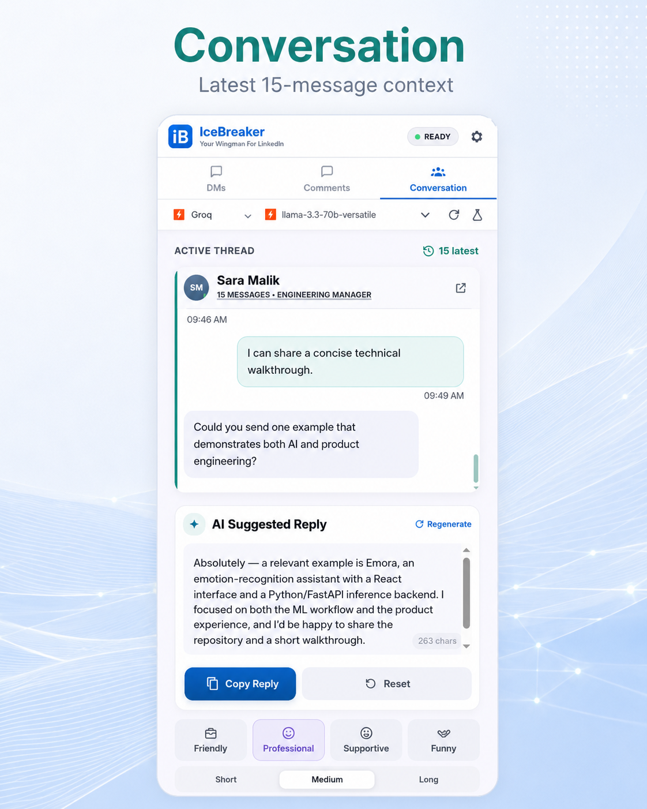
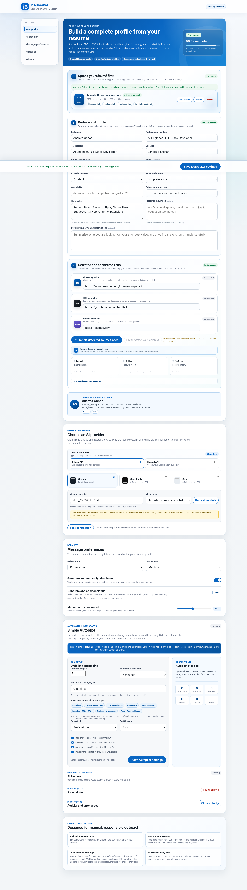
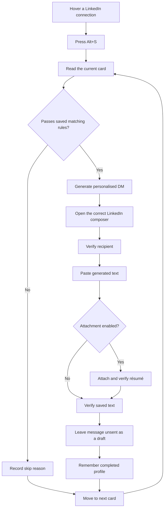
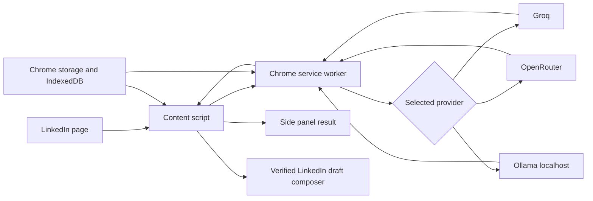

<p align="center">
  
</p>

<p align="center">
  <a href="LICENSE"></a>
  
  
  
  
</p>

<h3 align="center">Context-aware LinkedIn DMs, comments, conversation replies, and reviewable résumé-attached drafts.</h3>

<p align="center">
  <a href="#preview">Preview</a> ·
  <a href="#core-modes">Core modes</a> ·
  <a href="#connections-autopilot">Autopilot</a> ·
  <a href="#installation">Installation</a> ·
  <a href="#configuration">Configuration</a> ·
  <a href="#push-this-folder-without-cloning">Push without cloning</a>
</p>

---

## Overview

**IceBreaker** is a Chrome extension for faster, more relevant LinkedIn communication. It reads the LinkedIn content currently visible to the user, builds a focused prompt, and generates editable text through **Groq**, **OpenRouter**, or a local **Ollama** model.

It supports three context-aware writing modes and a review-first Connections Autopilot. Autopilot prepares drafts inside LinkedIn but never clicks **Send**.

### Why IceBreaker exists

Writing every outreach message, post comment, and inbox reply from scratch is repetitive. Generic templates are faster, but they usually ignore the person, post, conversation, and sender’s actual projects.

IceBreaker combines both sides:

- the visible LinkedIn context of the recipient, post, or conversation;
- the sender’s saved résumé, professional profile, and selected projects;
- an editable draft that remains under the user’s control.

---

## Preview

### One side panel, three modes

<p align="center">
  
</p>

<details>
<summary><strong>View individual mode screenshots</strong></summary>

#### DM mode

<p align="center">
  
</p>

#### Comments mode

<p align="center">
  
</p>

#### Conversation mode

<p align="center">
  
</p>

</details>

### Profile and settings workspace

<p align="center">
  
</p>

> Screenshot values are safe demonstration data. API keys are masked and no private provider credentials are included in the repository.

---

## Core modes

| Mode | Context IceBreaker reads | Output |
|---|---|---|
| **DMs** | A visible LinkedIn profile or connection card | A personalised outreach message grounded in the recipient and the sender’s saved background |
| **Comments** | The LinkedIn post currently under the pointer | A relevant, non-generic comment that responds to the actual post |
| **Conversation** | The visible LinkedIn inbox thread | A context-aware reply that follows the recent conversation |

### Shared controls

Every mode supports four context-specific vibes:

- **DMs:** Professional, Casual, Funny, and Engaging;
- **Comments:** Friendly, Funny, Insightful, and Supportive;
- **Conversation:** Friendly, Professional, Supportive, and Funny;
- **Short** (15–20 words), **Medium** (30–40 words), and **Long** (60–200 words) output, always ending at a complete sentence;
- editable generated text;
- Groq, OpenRouter, Ollama, or a manually supplied API key;
- `Alt+G` to generate a fresh result and `Alt+C` to copy the current result.

---

## Connections Autopilot

Connections Autopilot prepares reviewable LinkedIn drafts from a chosen starting card.

### Intended pipeline



### Matching modes

Autopilot can prepare drafts for:

1. **Recruiters and hiring decision-makers only** — the default.
2. **Every visible connection that passes filters**.
3. **Only custom titles or phrases** entered by the user.

Company, location, exclusion, duplicate, previous-run, existing-draft, and recipient-verification rules can be applied before a profile is completed.

### Draft completion rule

A profile counts as successfully prepared only after IceBreaker verifies:

```text
correct recipient
AND generated message inserted
AND enabled résumé attachment confirmed
AND draft remains in the LinkedIn composer
```

Skipped and failed profiles do not consume the successful-draft target. Profiles are remembered only after the appropriate skip or completion state is known.

### Safety boundary

IceBreaker does **not** click LinkedIn’s Send button. It enforces a configurable daily limit of up to 45 prepared drafts, leaves every message unsent, and lets the user review the recipient, wording, and optional attachment.

---

## Features

| Area | Capability |
|---|---|
| **Context capture** | Reads visible profiles, posts, and inbox conversations on LinkedIn |
| **Resume-first profile** | Stores the original PDF or DOCX locally and builds reusable professional context |
| **Professional links** | Saves optional LinkedIn, GitHub, and portfolio context for future generation |
| **Project matching** | Selects a relevant verified project rather than repeating the same project in every DM |
| **AI providers** | Groq, OpenRouter, Ollama, and manual cloud API mode |
| **Autopilot memory** | Remembers checked, skipped, failed, and drafted profiles across runs |
| **Duplicate protection** | Avoids overwriting existing text and reprocessing completed profiles |
| **Diagnostics** | Uses `AP-S…`, `AP-W…`, and `AP-E…` codes to show the exact skip, warning, or failure stage |
| **Keyboard workflow** | `Alt+G` to generate, `Alt+C` to copy, and `Alt+S` for hover-start Autopilot |
| **Local control** | Settings, résumé data, provider preferences, and Autopilot memory remain in the Chrome profile |

---

## Styling architecture

The React side panel and settings page use a locally bundled, tree-shaken Bootstrap 5 stylesheet plus compact IceBreaker theme modules (`*-theme.js`). Bootstrap handles reusable buttons, forms, cards, badges, layout and spacing; the small theme layer preserves IceBreaker colors, animations, pseudo-elements and responsive states. No external CSS CDN is used, so the extension remains compatible with Chrome Manifest V3. The LinkedIn content script keeps its isolated local style module to avoid leaking Bootstrap styles into LinkedIn.

## Architecture



### Main responsibilities

- **Content script:** reads visible LinkedIn context, tracks hover targets, opens and verifies composers, inserts text, attaches the résumé, and moves through connection cards.
- **Service worker:** creates provider prompts, calls the selected model, handles retries and fallbacks, and coordinates extension state.
- **Side panel:** provides mode, model, vibe, length, generation, copy, and Autopilot controls.
- **Options page:** manages the résumé, professional profile, provider settings, generation preferences, Autopilot rules, logs, and memory.
- **Local storage:** preserves preferences, profile context, run state, and the original résumé file.

---

## Tech stack

- Chrome Extension **Manifest V3**
- Vanilla **JavaScript**, **HTML**, and **CSS**
- Chrome Side Panel API
- Chrome Storage, Tabs, Scripting, Commands, Alarms, and Unlimited Storage APIs
- IndexedDB for the original résumé file
- Groq chat-completion API
- OpenRouter chat-completion API
- Ollama local REST API
- Local PDF and DOCX résumé parsing
- GitHub Actions for manifest, syntax, path, and credential validation

---

## Project structure

```text
IceBreaker/
├── manifest.json
├── README.md
├── LICENSE
├── CHANGELOG.md
├── .github/
│   ├── ISSUE_TEMPLATE/
│   └── workflows/
├── assets/
│   ├── branding/
│   ├── icons/
│   └── providers/
├── config/
│   └── .env.example
├── docs/
│   ├── assets/
│   │   ├── branding/
│   │   └── screenshots/
│   ├── guides/
│   ├── product/
│   └── security/
├── scripts/
│   ├── api/
│   ├── github/
│   └── ollama/
└── src/
    ├── backend/
    │   ├── background/
    │   ├── config/
    │   └── content/
    └── frontend/
        ├── options/
        ├── runtime/
        ├── shared/
        ├── sidepanel/
        └── vendor/
```

---

## Installation

### Load the extension locally

1. Download or extract the repository folder.
2. From the root folder, create the safe runtime key placeholder:

```powershell
Copy-Item src/backend/config/official-api-keys.example.js src/backend/config/official-api-keys.js
```

3. Open `chrome://extensions`.
4. Enable **Developer mode**.
5. Select **Load unpacked**.
6. Choose the folder containing `manifest.json`.
7. Open LinkedIn and launch IceBreaker from the Chrome toolbar or side panel.

### Keyboard shortcuts

Open `chrome://extensions/shortcuts` and confirm:

| Action | Default shortcut |
|---|---|
| Generate a fresh DM, comment, or reply | `Alt+G` |
| Copy the current generated text | `Alt+C` |
| Start Connections Autopilot from the hovered card | `Alt+S` |

---

## Configuration

### Manual Groq or OpenRouter key

Open **IceBreaker Settings → AI provider** and choose **Manual API**. The extension detects:

- `gsk_…` as Groq;
- `sk-or-…` as OpenRouter.

The manually entered key remains in the installed Chrome profile. Chrome extension storage is not a secure server-side vault, so use a limited-purpose key and rotate it when necessary.

### Ollama

1. Install and start Ollama.
2. Pull a supported local model:

```bash
ollama pull llama3.2
```

3. On Windows, run:

```text
scripts\ollama\Enable-Ollama-for-IceBreaker.bat
```

4. Reload IceBreaker from `chrome://extensions`.

### Private embedded-key build

> [!WARNING]
> A key embedded in a Chrome extension can be extracted. Do not publish an embedded-key build.

1. Copy `config/.env.example` to `config/.env`.
2. Add private provider keys locally.
3. Run:

```text
scripts\api\Build-Official-Keys.bat
```

Both `config/.env` and the generated `src/backend/config/official-api-keys.js` are blocked from Git by `.gitignore` and repository checks.

---

## Using the three modes

### DMs

1. Select **DMs**.
2. Hover a LinkedIn profile or connection card.
3. Review the extracted role, company, and location.
4. Generate the message.
5. Edit and copy it, or use Autopilot to prepare a verified draft.

### Comments

1. Select **Comments**.
2. Hover the intended LinkedIn post.
3. Generate a comment based on that post.
4. Review it before publishing.

### Conversation

1. Open a LinkedIn inbox conversation.
2. Select **Conversation**.
3. Hover the active conversation or message area.
4. Generate a reply based on the visible thread.
5. Confirm that the draft responds to the other participant rather than repeating your own message.

---

## Using Autopilot

1. Save an AI résumé in **Drafts & Settings → Autopilot**.
2. Select the successful-message target.
3. Choose the matching mode and optional company, location, include, and exclusion filters.
4. Open LinkedIn **My Network → Connections** or a supported 1st-degree People results page.
5. Hover the card where scanning should start.
6. Press `Alt+S`.
7. Review prepared drafts before manually sending them.

Autopilot should move forward only after the current profile is skipped with a recorded reason or its message and attachment are verified as a draft.

---

## Push this folder without cloning

The repository can be initialised and pushed directly from the extracted IceBreaker folder.

### Safe PowerShell workflow

```powershell
cd "D:\path\to\IceBreaker"

git init
git branch -M main

git remote add origin https://github.com/anamta-JINX/IceBreaker---Your_Wingman_For_LinkedIn.git
# If origin already exists instead:
# git remote set-url origin https://github.com/anamta-JINX/IceBreaker---Your_Wingman_For_LinkedIn.git

powershell -ExecutionPolicy Bypass -File scripts/github/pre-push-check.ps1

git add .
git commit -m "Release IceBreaker v1.4.84"

git fetch origin
# Run the next line only when the remote main branch already contains commits:
git merge origin/main --allow-unrelated-histories -X ours -m "Merge existing GitHub history"

git push -u origin main
```

A step-by-step copy is also available in [PUSH-WITHOUT-CLONING.md](PUSH-WITHOUT-CLONING.md).

> Avoid `git push --force` unless replacing the remote history is intentional and a backup exists.

---

## Validation

Run the repository check before every push:

```powershell
powershell -ExecutionPolicy Bypass -File scripts/github/pre-push-check.ps1
```

or:

```bash
bash scripts/github/pre-push-check.sh
```

The checks validate:

- `manifest.json` structure and referenced paths;
- JavaScript syntax;
- required extension files;
- accidentally tracked `.env` or generated key files;
- likely Groq or OpenRouter credentials.

GitHub Actions repeats these checks on pushes and pull requests.

---

## Privacy and responsible use

- IceBreaker reads LinkedIn content visible in the current browser page.
- The original résumé and extracted professional context are stored locally in the Chrome profile.
- Cloud providers receive the prompt context required for the selected generation request.
- Ollama requests stay on the local machine.
- Autopilot prepares unsent drafts and does not intentionally click **Send**.
- Users should review generated claims, recipient identity, wording, and attachments.
- Users remain responsible for complying with LinkedIn’s terms, applicable laws, and appropriate outreach practices.

See [SECURITY.md](SECURITY.md) for reporting security issues.

---

## Troubleshooting

| Code or symptom | Meaning / action |
|---|---|
| `E-KEY` | No usable cloud key is available. Save a manual key, use Ollama, or create a private local key build. |
| `E-429` | The cloud provider rate-limited the request. Wait, switch provider/model, or use Ollama. |
| `E408` | The Ollama request timed out. Confirm the local server and model are running. |
| `AP-S…` | A profile was skipped by a matching, duplicate, memory, or safety rule. |
| `AP-W…` | Autopilot recovered from a warning and continued. |
| `AP-E…` | An exact Autopilot pipeline stage failed; review the diagnostic text and profile activity log. |
| Composer opens but text is missing | Reload LinkedIn and the extension, then retry from the intended hovered card. |
| Old profile is always skipped | Clear Autopilot profile memory from Drafts & Settings, then retry. |

---

## Documentation

- [Autopilot technical guide](docs/guides/AUTOPILOT-TECHNICAL-GUIDE.md)
- [API key setup](docs/guides/API-KEY-SETUP.md)
- [Source code guide](docs/guides/SOURCE-CODE-GUIDE.md)
- [Distribution guide](docs/DISTRIBUTION.md)
- [Product requirements](docs/product/AUTOPILOT-PRD.md)
- [Changelog](CHANGELOG.md)

---

## Contributing

Contributions, bug reports, test cases, and selector updates are welcome. Read [CONTRIBUTING.md](CONTRIBUTING.md) before opening a pull request.

- [Report a bug](.github/ISSUE_TEMPLATE/bug_report.yml)
- [Request a feature](.github/ISSUE_TEMPLATE/feature_request.yml)
- [Code of Conduct](CODE_OF_CONDUCT.md)
- [Support](SUPPORT.md)

---

## License

Released under the [MIT License](LICENSE).

## Author

**Anamta Gohar**  
Email: `anamta.gohar25@gmail.com`  
GitHub: [@anamta-JINX](https://github.com/anamta-JINX)

<p align="center">
  
</p>

---

<p align="center">
  IceBreaker is an independent project and is not affiliated with, endorsed by, or sponsored by LinkedIn Corporation.
</p>
